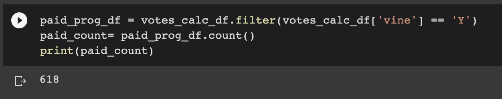
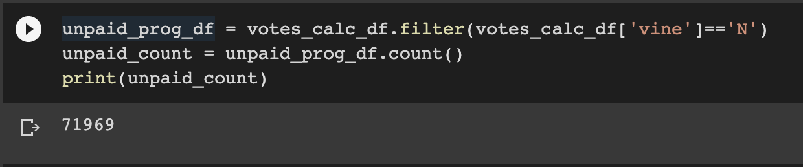
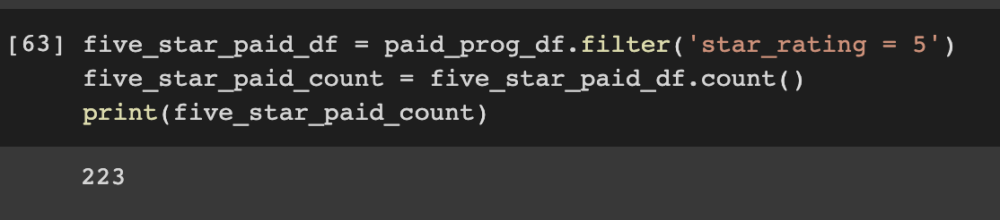
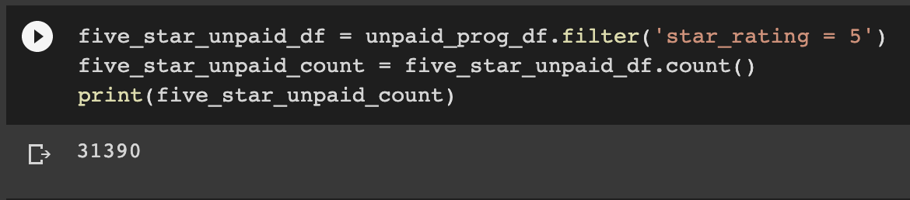
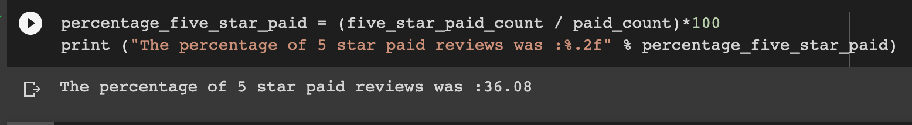
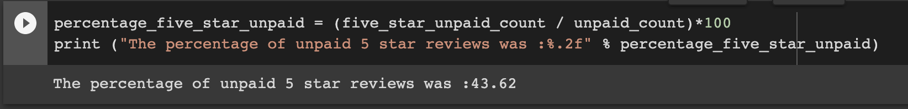

# Amazon_Vine_Analysis

## Deliverable 1 queries

Find query results [here](https://github.com/Jusharry/Amazon_Vine_Analysis/tree/main/sql%20queries)

## Overview of the Analysis
The purpose of this analysis is to extract , transorm and load data based on the reviews collected by Amazon for their Wireless devices by using PySpark to load the data into pgAdmin via AWS RDS. 

## Results

* Based on calculations the number of Vine and non-Vine reviews are as follows:

- Number of Vine reviews 

- Number of non-Vine reviews

* The number of 5 star Vine and non-Vine reviews are as follows:

- Number of 5 star Vine reviews 

- Number of 5 star non-Vine reviews

The percentage of 5 star Vine and non-Vine reviews are as follows:

- Percentage of 5 star Vine reviews

- Percentage of 5 stay non-Vine reviews

## Summary

The results of this analysis clearly indicate that there is not a bias towards Vine reviews or 5 star Vine reviews as it is clearly visible that there were more non-Vine reviews tabulated for boh categories . This is also true for the resultant percentages where a larger percentage of 5 star reviews came from non Vine program participants(43.62%) vs Vine reviews at (36.08%).
 A futher analysis that could be useful is to use the NaiveBayes model to attempt to predict the likelihood of review being written by a Vine vs non Vine user . 

 See prediction [here](Further_challenge__analysis.ipynb)